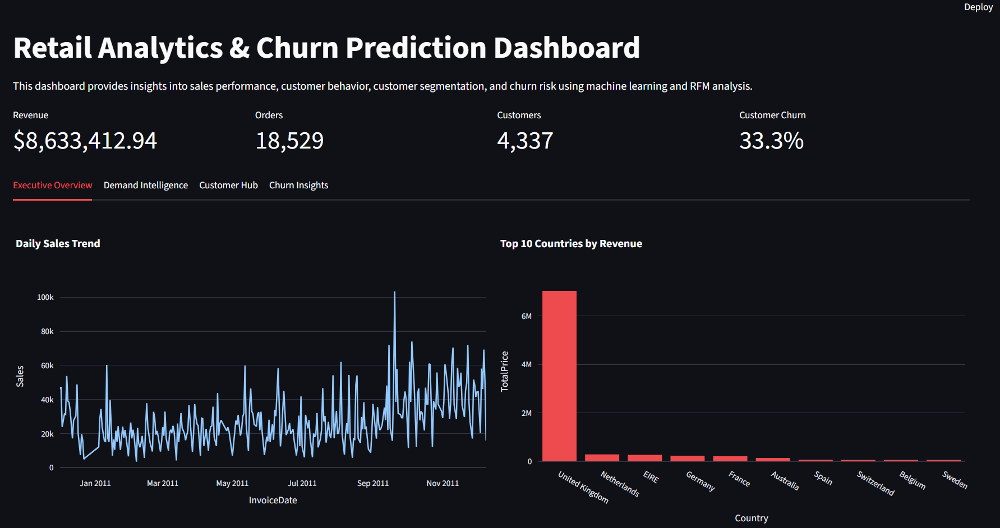

# NeuralRetail Analytics Platform

End-to-end Retail Analytics and Customer Churn Prediction system built using Python, Machine Learning, Streamlit, FastAPI, MLflow, and Docker.

---

## 🚀 Project Overview

This project analyzes retail transaction data to generate business insights and predict customer churn risk.

It demonstrates how raw business data can be transformed into actionable insights and deployed as a production-ready machine learning system.

---

## 🎯 Why This Project

This project showcases the full lifecycle of a data-driven solution—from data processing and modeling to deployment and production readiness.

It highlights the ability to:

* Translate business problems into ML solutions
* Build interactive analytics dashboards
* Deploy models as real-time APIs
* Implement MLOps practices for scalability

---

## 📈 Business Impact

* Identified high-risk churn customers using predictive modeling
* Enabled data-driven decision making through KPI dashboards
* Improved visibility into customer behavior and revenue trends
* Provided a scalable solution for real-time churn prediction

---

## 🏗️ Architecture

```
Raw Data → Data Cleaning → Feature Engineering → ML Model
            ↓
      Streamlit Dashboard (Visualization)

ML Model → FastAPI API → Docker Container
        ↓
     MLflow Tracking (Experiments)
```

---

## 📊 Features

### 🔹 Analytics

* Revenue tracking and KPIs
* Customer segmentation
* Country-level insights
* Sales trend visualization

### 🔹 Machine Learning

* Logistic Regression churn model
* Feature engineering (orders, spend, lifetime)
* Probability-based predictions

### 🔹 Dashboard (Streamlit)

* Executive overview
* Customer insights
* Churn analysis
* Filters (date, country)

---

## 🤖 Model Details

* **Algorithm:** Logistic Regression
* **Features Used:**

  * TotalOrders
  * TotalQuantity
  * TotalSpend
  * CustomerLifetime
  * AvgOrderValue
* **Output:**

  * Churn prediction (0 or 1)
  * Churn probability score

---

## ⚙️ Advanced MLOps Layer

### 🔹 MLflow

* Experiment tracking
* Metrics logging (accuracy, recall)
* Model artifact storage

### 🔹 FastAPI

* REST API for real-time predictions
* Endpoint: `/predict`

### 🔹 Docker

* Containerized API deployment
* Portable and scalable system

---

## 🔌 API Preview

**POST /predict**

```json
{
  "TotalOrders": 3,
  "TotalQuantity": 20,
  "TotalSpend": 500,
  "CustomerLifetime": 120,
  "AvgOrderValue": 166.6
}
```

**Response:**

```json
{
  "prediction": 0,
  "churn_probability": 0.477
}
```

---

## 🖥️ Dashboard



---

## 📁 Project Structure

```
NeuralRetail_Project_Advanced/
│
├── api/                 # FastAPI + model
├── mlops/               # MLflow tracking
├── docker/              # Docker setup
├── data/                # raw + processed data
├── notebooks/           # data analysis
├── app.py               # Streamlit dashboard
├── requirements.txt
└── README.md
```

---

## 🚀 How to Run

### 1. Run Dashboard

```bash
streamlit run app.py
```

### 2. Run API

```bash
python -m uvicorn api.main:app --reload
```

### 3. Run with Docker

```bash
docker build -f docker/Dockerfile.api -t neuralretail-api .
docker run -p 8000:8000 neuralretail-api
```

---

## 💼 Skills Demonstrated

* Data Analysis & Feature Engineering
* Machine Learning (Scikit-learn)
* Data Visualization (Streamlit)
* API Development (FastAPI)
* Experiment Tracking (MLflow)
* Containerization (Docker)
* End-to-End System Design

---

## 🎯 Outcome

Built a production-ready retail analytics system capable of:

* Delivering business insights
* Predicting churn risk
* Serving real-time predictions via API
* Deploying in a containerized environment

---

## 👨‍💻 Author

Mirza Sharif Baig
